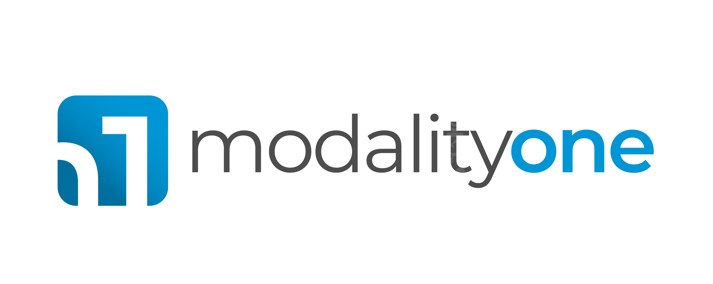

:favicon:
:icons: font
:source-highlighter: pygments

Modality is a free, open-source, hospitality-oriented booking system, currently in development. It will support significant event complexity, unmatched by any existing open-source solution.

Modality will support:

- short and long events (evenings, days, weekends, weeks)
- one-time and recurring events
- partial and full attendance
- single and multiple venues
- multiple accommodation locations and types
- transport options (parking and shuttles)
- catering options
- multi-stage payments and discounts
- detailed statistics

Modality will be useful for:

- event-oriented organisations
- hotels

=== Why the name?
'Modality' is a fusion of two words, 'modular' and 'hospitality', a nod to both the software's design and purpose.

=== Status
Modality is in the early stages of active development, and we intend to release a functioning MVP by early-2024.

Whilst the server and data models are complete, the clients have significant work remaining before they are viewable. Currently, only the Back-Office client can be compiled and run successfully from the IDE.

=== Open-source
Modality is licensed under the link:https://github.com/modalityone/modality/blob/main/LICENSE[Apache License Version 2.0^], is completely free to use and modify, and is available on link:https://github.com/modalityone/modality[GitHub^].

== The Modality Architecture
=== Java for the Web
Modality is the first large-scale Java project to use link:https://webfx.dev[WebFX^] - a toolkit that transpiles JavaFX applications into pure JavaScript web apps for direct execution in the browser.

=== Technologies
Modality is developed using the following technologies:

[cols="1,1,1"]
|===
| Technology | Purpose | Version

| link:https://www.oracle.com/java/technologies/downloads/[Java^] | Codebase | 18
| link:https://openjfx.io/[JavaFX^] | Mobile user interfaces | 18
| link:https://docs.webfx.dev/[WebFX^] | Web user interfaces | Latest (Beta)
|===

...consists of four end-user client applications:

[cols="1,1,1"]
|===
| Application | Used By | Compilation Toolchain

| Back-Office Web | Administrator | WebFX + GWT
| Back-Office Tablet | Administrator | Gluon
| Front-Office Web | Customer | WebFX + GWT
| Front-Office Mobile | Customer | Gluon
|===

...two developer client applications:

[cols="1,1,1"]
|===
| Application | Used By | Compilation Toolchain

| Back-Office Desktop | Developer | JavaFX
| Front-Office Desktop | Developer | JavaFX
|===

...one web server:

[cols="1,1,1"]
|===
| Application | Purpose | Version

| link:https://vertx.io/[Vert.x^] | Interface between client apps and back-end services; serves the SPA | Latest
|===

...and depends on the following services:

[cols="1,1,1"]
|===
| Service | Purpose | Version

| link:https://www.postgresql.org/[Postgres^] | Database | 14.2
| link:https://redis.io/[Redis^] | Session management | 6.2.6
| link:https://flywaydb.org/[Flyway^] | Database schema updates | Latest
|===

=== Layers
Modality is divided into layers of functionality, shown below:

[cols="1,1,1"]
|===
| Layer | Repository | Java Modules

| Business Logic (top layer) | link:https://github.com/modalityone/modality[modality^] | modality-event, modality-hotel, modality-restaurant, modality-catering
| Ecommerce | link:https://github.com/modalityone/modality[modality^] | modality-ecommerce
| CRM | link:https://github.com/modalityone/modality[modality^] | modality-crm
| Base | link:https://github.com/modalityone/modality[modality^] | modality-base
| WebFX Stack | link:https://github.com/webfx-project/webfx-stack[webfx-stack^] | webfx-stack
| WebFX (bottom layer) | link:https://github.com/webfx-project/webfx[webfx^] | webfx-kit
|===

==== Business logic
The highest layer of the architecture consists of business-specific modules implementing logic for events, hotels, restaurants etc. This is a customisable layer, and developers can choose to add only the modules they need, as well as provide their own.

==== Ecommerce
The next layer down is the ecommerce layer. This provides a generic domain model for ecommerce, which models sales, accounts etc. It is the location for payment gateway integration and ecommerce-specific UIs.

==== CRM
The CRM layer provides the essential CRM features, including customer accounts, integrated mailing system etc.

==== Base
The Base layer is a fully operational implementation of the WebFX Stack layer beneath, based on the Postgres database. This layer is a pure technical solution that isn't bound to any specific domain, and so is large in application scope.

==== WebFX Stack
The WebFX Stack layer provides an opinionated framework for developing enterprise applications with WebFX. This layer is responsible for communication between client and server (using a WebSocket bus), UI routing, ORM, push notification, auth, i18n, etc. Interfaces in all cases, but not always full implementations, allowing this layer to be adapted to any kind of system.

Unlike most Java frameworks, this layer works principally on the client side, following the trend initiated by mobile apps where most of the application code has been moved to the client and can run offline.

It is designed to work with JavaFX (for example, i18n provides JavaFX bindings for use with any kind of control; and the authorisation framework automatically enables/disables and shows/hides controls depending on user access).

==== WebFX
WebFX is the foundation layer, providing a web port of JavaFX (in the webfx-kit module) that can be compiled by GWT together with your application code. It is a Java-based cross-platform solution that can be used in any domain.

=== All-Layer Aggregation
Modality ships with the `modality-all` module, which aggregates together the full set of modules across all layers, for use by developers right away.

== The Modality Apps
=== Web apps
Modality uses WebFX to transpile it's JavaFX codebase into a single-page application for direct execution in the browser. No server-side rendering, and no plugins required.

=== Mobile apps
Modality uses the link:https://gluonhq.com/products/mobile/[Gluon^] toolchain to compile the codebase into native, installable apps ready for inclusion into the Google Play and Apple App stores.

=== Desktop apps
Modality also provides desktop apps, which have exactly the same UI as the web apps generated from the same source. This is useful for developers, allowing Java code to be rapidly developed and tested via the desktop, before subsequent transpilation into JavaScript and mobile (which takes time).
